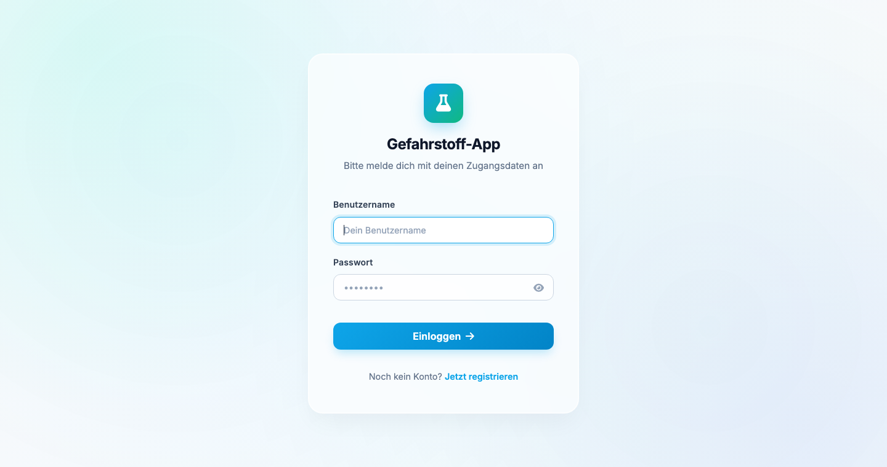
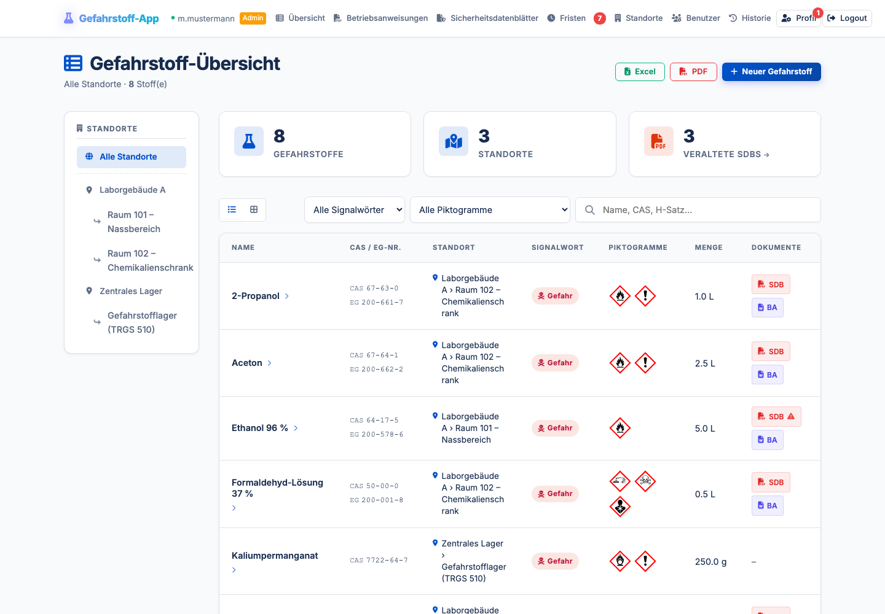
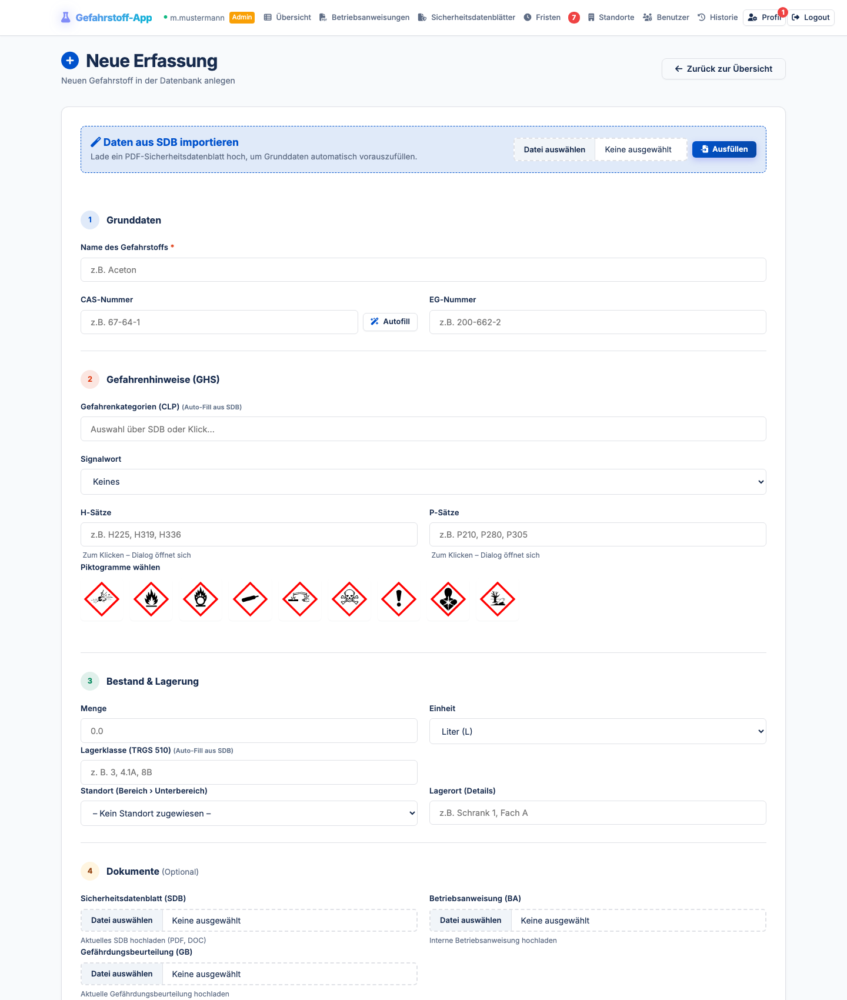
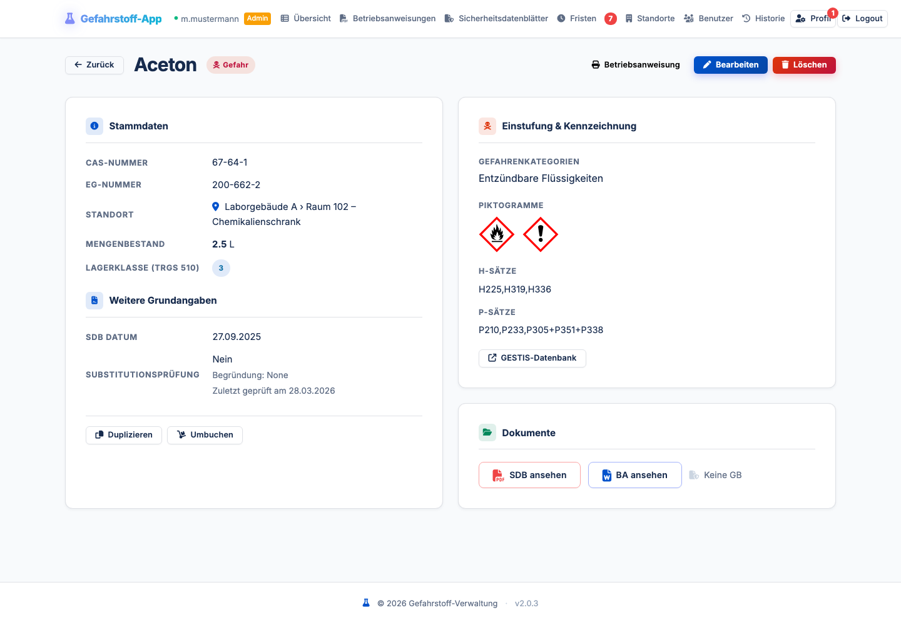
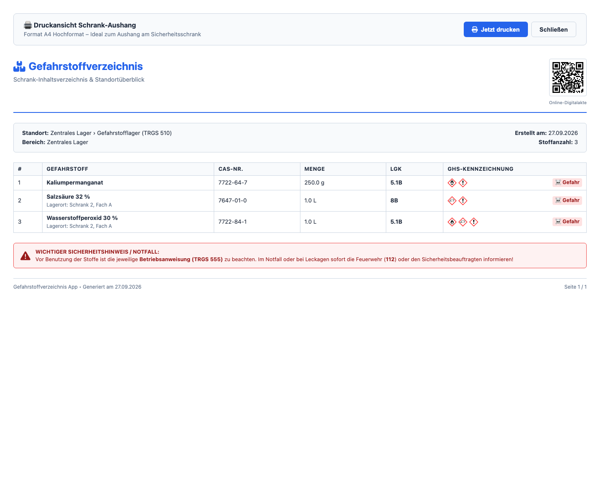
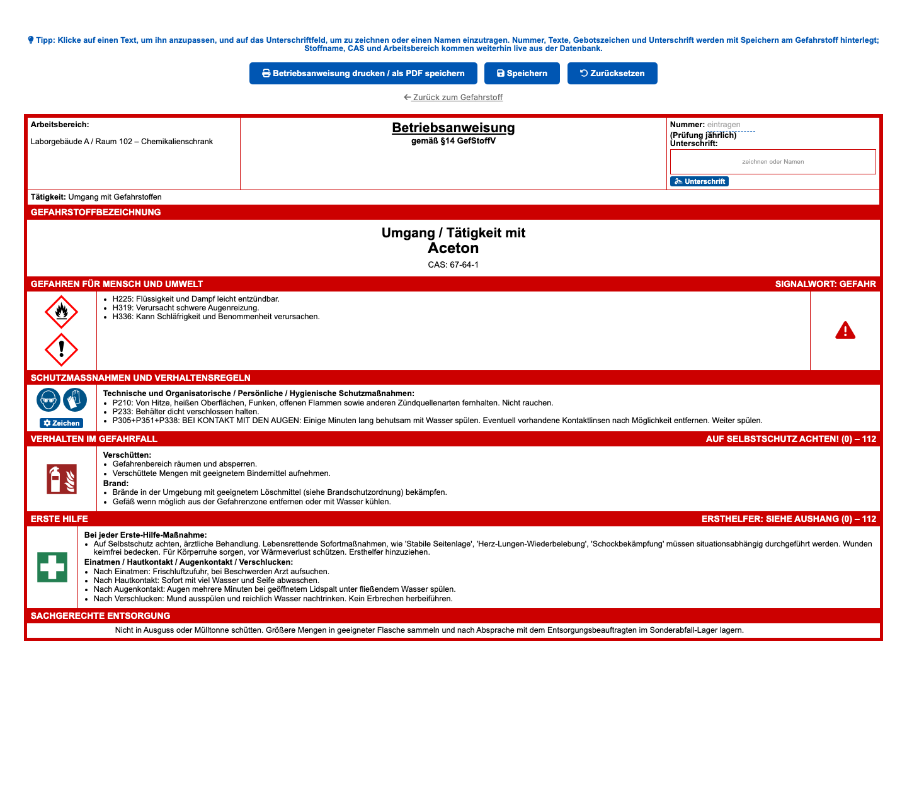
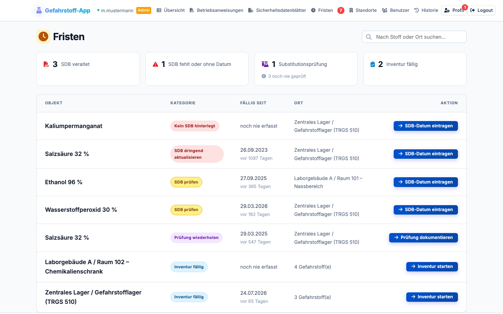

# 📘 Benutzerhandbuch: Gefahrstoffverzeichnis

**Version 3.19 · Stand 27. September 2026**

Willkommen im Gefahrstoffverzeichnis. Diese Anwendung verwaltet Gefahrstoffe,
ihre Lagerorte, Sicherheitsdatenblätter und Betriebsanweisungen — und sie
erinnert daran, was als Nächstes zu tun ist.

Dieses Handbuch beschreibt alle Funktionen und das Berechtigungskonzept. Es
setzt keine Vorkenntnisse voraus. Wo eine Angabe rechtlich relevant ist, steht
die Vorschrift dabei, damit Sie sie prüfen können.

---

## 1. Über dieses Handbuch

* **Zielgruppe:** alle Nutzerinnen und Nutzer der Anwendung — vom Auszubildenden
  mit Lesezugriff bis zur Laborleitung.
* **Was es nicht ersetzt:** die *Sicherheitsdatenblätter* und die
  *Betriebsanweisungen* selbst. Dieses Handbuch erklärt die Anwendung, nicht die
  Gefahren einzelner Stoffe.
* **Angaben zur Datenschutz-Dokumentation:** Für den Datenschutzbeauftragten gibt
  es das gesonderte Dokument `DATENSCHUTZ_UND_TOM.md` (Technisch-Organisatorische
  Maßnahmen).

## 2. Erste Schritte

### 2.1 Anmeldung

Rufen Sie die Adresse der Anwendung im Browser auf und melden Sie sich mit
Benutzername und Passwort an. Die Anwendung läuft im Intranet; eine Installation
auf Ihrem Rechner ist nicht nötig.

### 2.2 Der erste Administrator

Beim allerersten Start ist die Anwendung leer. Der **erste** Account, der über
die Registrierung angelegt wird, erhält dauerhaft Administratorrechte. Danach
ist die Selbstregistrierung abgeschaltet — weitere Konten legt ein Administrator
an (siehe Abschnitt 12).

> ⚠️ **Prüfen Sie den Benutzernamen des ersten Kontos.** Er lässt sich später
> zwar ändern, aber die Anmeldung läuft darüber. Bewahren Sie das Passwort
> sicher auf: Ohne einen Administrator kommt niemand mehr in die
> Benutzerverwaltung.

### 2.3 Passwort ändern

Über **Profil** in der Navigation. Das Passwort muss mindestens vier Zeichen
haben. Jede Änderung wird in der Systemhistorie vermerkt — ohne das Passwort
selbst (Abschnitt 13).

### 2.4 Abmelden

Über **Logout**. Schließen Sie den Browser auf gemeinsam genutzten Geräten
zusätzlich, damit die Sitzung nicht wiederhergestellt wird.

## 3. Die Oberfläche

### 3.1 Navigation

Die Leiste oben führt zu allen Bereichen. Was Sie sehen, hängt von Ihrer Rolle
ab:

| Menüpunkt | Wofür |
|---|---|
| **Übersicht** | Das Dashboard mit allen Gefahrstoffen Ihrer Bereiche |
| **Betriebsanweisungen** | Sammelliste aller Betriebsanweisungen |
| **Sicherheitsdatenblätter** | Sammelliste aller Datenblätter mit Aktualitätsstand |
| **Fristen** | Offene Aufgaben, mit der Anzahl im Menüpunkt |
| **Standorte** | Bereiche und Unterbereiche, QR-Codes, Inventur (ab Moderator) |
| **Benutzer** | Benutzerverwaltung (ab Moderator) |
| **Historie** | Systemhistorie (nur Administrator) |
| **Profil** | Eigenes Passwort, offene Freigaben |

Auf schmalen Bildschirmen — auf dem Tablet oder Telefon unter etwa 1340 Pixel —
klappt die Navigation zu einem Menüknopf zusammen.

### 3.2 Das Dashboard

* **Kennzahlen:** Anzahl Gefahrstoffe, Anzahl Standorte und *veraltete SDBs*.
  Die dritte Kachel ist anklickbar und führt zur Fristenliste.
* **Standort-Spalte links:** die Hierarchie Ihrer Bereiche. Ein Klick filtert die
  Tabelle auf diesen Standort.
* **Suche und Filter:** Suchfeld (Name, CAS-Nummer, H-Sätze), Filter nach
  Signalwort und Piktogrammen.
* **Zwei Ansichten:** Tabelle (Liste) und Kacheln — die Wahl wird im Browser
  gemerkt.
* **Export:** Die **gefilterte** Ansicht als Excel-Tabelle oder PDF.

### 3.3 Was Sie sehen — und was nicht

Sie sehen nur Gefahrstoffe aus Ihren Bereichen und die, die Sie selbst angelegt
haben. Das gilt überall in der Anwendung, auch für Exporte und die Fristenliste.

## 4. Gefahrstoffe verwalten

### 4.1 Anlegen

**Übersicht → Neuer Gefahrstoff** (oder `/add`). Das Formular ist in vier
Abschnitte gegliedert:

1. **Grunddaten** — Name (Pflicht), CAS-Nummer, EG-Nummer
2. **Gefahrenhinweise (GHS)** — Gefahrenkategorien, Signalwort, H- und P-Sätze,
   Piktogramme
3. **Bestand & Lagerung** — Menge und Einheit, Lagerklasse, Standort, Lagerort
4. **Dokumente** — Sicherheitsdatenblatt, Betriebsanweisung,
   Gefährdungsbeurteilung (jeweils als PDF, DOC oder DOCX)

### 4.2 Die Felder im Einzelnen

| Feld | Bedeutung |
|---|---|
| **Name** | Bezeichnung, wie sie im Verzeichnis erscheint. Pflichtfeld. |
| **CAS-Nummer** | Eindeutige Nummer des Stoffes (z. B. `67-64-1` für Aceton). |
| **EG-Nummer** | Nummer aus dem europäischen Stoffverzeichnis. |
| **Gefahrenkategorien** | Einstufung nach CLP (z. B. „Entzündbare Flüssigkeiten"). |
| **Signalwort** | „Gefahr" oder „Achtung" — abhängig von der Einstufung. |
| **H-Sätze** | Gefahrenhinweise, z. B. `H225` („Flüssigkeit und Dampf leicht entzündbar"). |
| **P-Sätze** | Sicherheitshinweise, z. B. `P210` („Von Hitze fernhalten"). |
| **Piktogramme** | Die rot-umrandeten GHS-Symbole. Mehrfachauswahl. |
| **Menge / Einheit** | Bestandsmenge, z. B. `2,5` Liter. |
| **Lagerklasse** | LGK nach TRGS 510 (z. B. `3`, `8B`, `5.1B`). Grundlage der Zusammenlagerungsprüfung. |
| **Standort** | Bereich und Unterbereich aus der Standortverwaltung. |
| **Lagerort** | Freitext für die Feinheit, z. B. „Schrank 2, Fach A". |
| **Datum SDB** | Datum des Sicherheitsdatenblatts. Steuert die Frist (Abschnitt 8). |
| **Substitutionsprüfung** | „Ja" (Ersatzstoff vorhanden) oder „Nein" (keiner möglich), dazu **„Zuletzt geprüft am"**. |
| **Ersatzstoff / Begründung** | Je nach Auswahl: welcher Ersatzstoff, oder warum keiner möglich ist. |

H- und P-Sätze wählen Sie über ein Auswahlfenster: Klicken Sie in das Feld, dann
öffnet sich eine durchsuchbare Liste. Sie können die Sätze auch direkt tippen.

### 4.3 Automatisches Ausfüllen

Die Anwendung nimmt Ihnen die Tipparbeit ab:

**Sicherheitsdatenblatt auslesen.** Laden Sie im oberen Feld ein
SDB-PDF hoch und klicken auf **Ausfüllen**. Die Anwendung liest CAS- und
EG-Nummer, Signalwort, Piktogramme sowie H- und P-Sätze aus dem PDF.

**CAS-Nummer nachschlagen.** Tippen Sie eine CAS-Nummer ein und klicken auf
**Autofill** — die Daten kommen aus der PubChem-Datenbank der US-Behörde NIH.

> ⚠️ **Zum Autofill:** Dabei wird die CAS-Nummer an einen Server außerhalb Ihres
> Netzes übertragen. Die Anwendung selbst lädt sonst **keine** externen
> Ressourcen. Wenn Ihr Betrieb keine Verbindung nach außen zulassen will, lassen
> Sie das Feld einfach von Hand ausfüllen oder nutzen Sie das SDB-Auslesen,
> das vollständig lokal arbeitet.

**Immer prüfen.** Beide Verfahren liefern Vorschläge, keine Gewissheit. Lesen Sie
besonders Signalwort, H-Sätze und Piktogramme gegen das Original nach — sie
bestimmen den Inhalt der Betriebsanweisung.

### 4.4 Ansehen, Bearbeiten, Kopieren, Verschieben

* **Ansehen:** Klick auf den Namen. Die Detailansicht zeigt alle Angaben, die
  angehängten Dokumente und — falls vorhanden — Zusammenlagerungshinweise.
* **Bearbeiten:** Bleistiftsymbol. Zuständig sind alle, die den Stoff verwalten
  dürfen (siehe Abschnitt 11).
* **Kopieren:** Erzeugt einen vollständigen zweiten Eintrag für einen anderen
  Standort. Lagerklasse, Gefahrenkategorien und die Substitutionsprüfung werden
  mitgenommen.
* **Verschieben:** Ändert nur den Standort des Stoffes.

### 4.5 Löschen und Archivieren

Gefahrstoffe werden beim Löschen **nicht** entfernt, sondern archiviert
(`is_deleted`) — sie verschwinden aus allen Listen, bleiben aber in der Datenbank
und in der Systemhistorie.

> ⚠️ **Ein Wiederherstellen gibt es in der Oberfläche nicht.** Ein versehentlich
> archivierter Stoff lässt sich nur über einen direkten Eingriff in die Datenbank
> zurückholen. Prüfen Sie vor dem Löschen, ob der Stoff nicht besser verschoben
> oder korrigiert wird.

## 5. Standorte, QR-Codes und Inventur

### 5.1 Aufbau

Standorte sind hierarchisch: **Bereiche** (z. B. „Laborgebäude A") enthalten
**Unterbereiche** (z. B. „Raum 102 – Chemikalienschrank"), und Unterbereiche
können weitere Unterbereiche enthalten. Bereiche können einer Moderatorin oder
einem Moderator als „Besitzer" zugeordnet werden.

Bereiche und Unterbereiche legen Sie unter **Standorte** an (ab Moderator).

### 5.2 QR-Codes

Für jeden Unterbereich lässt sich ein QR-Code als druckbare Ansicht erzeugen.
Hängen Sie ihn am Schrank aus: Wer ihn mit der Telefonkamera scannt, landet
direkt in der auf diesen Schrank gefilterten Liste. Der Code wird lokal erzeugt.

### 5.3 Schrank-Aushang

Eine druckfertige A4-Seite mit dem Inhalt eines Schranks: Gefahrstoffe mit
Piktogrammen, Mengen, Lagerklassen, Notfallhinweisen und QR-Code.

### 5.4 Schnell-Inventur

Die Inventur ist für die Bedienung am Telefon gedacht: große Kästchen zum
Abhaken, Mengen direkt korrigierbar. Wer die Inventur durchführt, wird mit Datum
am Stoff vermerkt — und die Inventurfrist beginnt von vorn (Abschnitt 8).

### 5.5 Einen Standort löschen — was dabei passiert

> ⚠️ **Dieser Punkt hat Folgen, die man kennen muss.** Beim Löschen eines
> Standorts werden die enthaltenen **Gefahrstoffe nicht gelöscht**. Sie verlieren
> nur ihre Zuordnung.

* Beim Löschen eines **Bereichs** verschwinden alle seine Unterbereiche mit.
* Die Gefahrstoffe bleiben erhalten und stehen danach **ohne Standort** da.
* **Die Folge:** Ein Gefahrstoff ohne Standort ist nur noch für seinen
  **Ersteller** und für Administratoren sichtbar. Alle anderen, die vorher über
  den Bereich Zugriff hatten, sehen ihn danach nicht mehr.
* Die Systemhistorie hält fest, wie viele Unterbereiche und Gefahrstoffe
  betroffen waren.

Prüfen Sie deshalb vor dem Löschen, ob die Stoffe vorher verschoben werden
sollten.

## 6. Betriebsanweisungen

Die Betriebsanweisung ist nach §14 GefStoffV vorgeschrieben und die Grundlage
jeder Unterweisung. Die Anwendung erzeugt sie aus den Stoffdaten und lässt sie
anpassen.

### 6.1 Aufrufen

Von der Detailansicht eines Gefahrstoffs oder über **Betriebsanweisungen** in der
Navigation.

### 6.2 Inhalte bearbeiten

Klicken Sie auf einen Text, um ihn zu ändern — Tätigkeit, H-Sätze,
Schutzmaßnahmen, Verhalten beim Verschütten, bei Brand, Erste Hilfe und
Entsorgung. Die Felder sind direkt auf der Seite schreibbar.

Nicht bearbeitbar sind **Arbeitsbereich und Stoffname**: Beide kommen live aus
der Datenbank. So bleibt die Anweisung richtig, wenn ein Stoff später umbenannt
oder verschoben wird.

### 6.3 Gebotszeichen

Bis zu **sechs** Gebotszeichen (blau-weiße Symbole, z. B. Augenschutz,
Schutzhandschuhe) wählen Sie über das Auswahlfenster. Der Zähler zeigt, wie viele
noch frei sind.

### 6.4 Unterschrift

Unter „Unterschrift" öffnet ein Klick ein Feld mit zwei Möglichkeiten:

* **Zeichnen** mit Maus oder Finger — wird als Bild gespeichert.
* **Namen eintragen** — erscheint im Ausdruck als „gez. M. Mustermann".

Ist keine Unterschrift gesetzt, bleibt im Ausdruck ein leeres umrandetes Feld
stehen — die Zeile zum handschriftlichen Unterschreiben.

> **Rechtsnatur:** Eine gezeichnete oder eingetippte Unterschrift ist eine
> *einfache* elektronische Signatur im Sinne von eIDAS, **keine qualifizierte
> (QES)**. Eine Identitätsprüfung findet nicht statt. Für die interne
> Dokumentation ist das üblich; verlangt eine Nachweispflicht eine QES, reicht
> es nicht.

### 6.5 Speichern und Zurücksetzen

**Speichern** legt die Texte, Gebotszeichen und die Unterschrift am Gefahrstoff
ab. **Zurücksetzen** stellt die Standardwerte wieder her. Beides wird in der
Systemhistorie vermerkt — der Inhalt der Unterschrift steht dort **nicht**.

### 6.6 Drucken

**Betriebsanweisung drucken / als PDF speichern** erzeugt den Ausdruck: eine
A4-Seite, ohne Kopf- und Fußzeile des Browsers.

> ⚠️ **Wenn der Ausdruck schwarzweiß herauskommt:** Prüfen Sie zuerst, ob im
> Druckdialog unter „Weitere Einstellungen" die **Hintergrundgrafiken**
> angehakt sind. Die Farben der Anweisung kommen überwiegend aus
> Hintergrundflächen; ohne diesen Haken druckt der Browser sie weiß. Die
> Unterscheidung: bleibt der **rote Rahmen** rot und nur Balken und Felder sind
> weiß, war es diese Einstellung. Ist **alles** dunkelgrau, steht der Drucker
> oder der Dialog auf Graustufen — dann hilft nur eine Änderung dort.

## 7. Sicherheitsdatenblätter

Die Sammelliste unter **Sicherheitsdatenblätter** zeigt alle hinterlegten
Datenblätter mit ihrem Alter:

| Anzeige | Bedeutung |
|---|---|
| **Aktuell** (grün) | jünger als 3 Jahre |
| **Aktualisierung prüfen** (gelb) | älter als 3 Jahre |
| **Dringend aktualisieren** (rot) | älter als 5 Jahre |
| **Kein Datum erfasst** | Dokument vorhanden, aber ohne Datum |

Stoffe **ohne** hinterlegtes Datenblatt erscheinen in dieser Liste nicht — sie
stehen aber in der Fristenliste (Abschnitt 8). Ein Gefahrstoff ohne
Sicherheitsdatenblatt sollte nicht in Gebrauch sein.

## 8. Fristen — was zu tun ist

Die Seite **Fristen** sammelt die offenen Aufgaben aus Ihren Gefahrstoffen, die
dringlichsten zuerst. Jede Zeile hat einen Knopf, der direkt zur erledigenden
Aktion führt. Die Zahl im Menüpunkt entspricht der Anzahl der Zeilen.

### 8.1 Wann etwas fällig ist

| Prüfung | Frist | Was zu tun ist |
|---|---|---|
| Sicherheitsdatenblatt | Datum älter als 3 Jahre | „SDB-Datum eintragen" → neues Datum setzt die Frist zurück |
| Sicherheitsdatenblatt | Datum älter als 5 Jahre (dringend) | ebenso |
| Kein Sicherheitsdatenblatt | immer fällig | Dokument am Gefahrstoff hinterlegen |
| Dokument ohne Datum | immer fällig | Datum nachtragen |
| Substitutionsprüfung | keine Prüfung dokumentiert | **als Zahl**, siehe unten |
| Substitutionsprüfung | Prüfung vermerkt, aber ohne Datum | Datum nachtragen |
| Substitutionsprüfung | letzte Prüfung älter als 24 Monate | Datum der erneuten Prüfung eintragen |
| Inventur | jüngste Inventur des Standorts älter als 12 Monate — oder noch nie | „Inventur starten" → die Inventur setzt das Datum |

### 8.2 Zeile oder Zahl — der Unterschied

**„Noch nie geprüft" erscheint als Zahl, nicht als Zeile.** Wäre jeder Stoff ohne
Substitutionsprüfung eine eigene Zeile, würde die Liste bei einem gewachsenen
Verzeichnis unbrauchbar. Die Zahl steht unter der Substitutions-Kachel
(„12 noch nie geprüft") und zählt **nicht** in die Kachelzahl hinein — diese
bleibt die Zahl der Zeilen, damit Kachel und Liste zusammenpassen.

Die Kachel **„Veraltete SDBs"** auf dem Dashboard zählt nur die veralteten
Sicherheitsdatenblätter. Oben auf der Fristenseite stehen zusätzlich die
fehlenden Dokumente, die offenen Substitutionsprüfungen und die fälligen
Inventuren.

### 8.3 Woher die Intervalle kommen — bitte genau lesen

* **Sicherheitsdatenblatt: 3 und 5 Jahre.** Die Anwendung mahnt nach drei Jahren
  zur Prüfung und nach fünf Jahren dringend. Ein gesetzliches Intervall gibt es
  dafür nicht — der Hersteller muss das Datenblatt aktualisieren, wenn sich
  etwas ändert. Die Werte sind betriebliche Konvention.
* **Inventur: 12 Monate.** Ebenfalls betriebliche Konvention; passen Sie sie an
  Ihre Praxis an.
* **Substitutionsprüfung: 24 Monate.** §7 GefStoffV verlangt die Prüfung und ihre
  Dokumentation, TRGS 600 beschreibt das Vorgehen. Wiederholt wird sie bei neuen
  Erkenntnissen, nicht nach festen Jahren. Die 24 Monate sind **eine interne
  Konvention dieses Betriebs, keine Vorschrift**.
* **Der Fall „nie geprüft" ist dagegen keine Konvention**, sondern eine Lücke:
  §7 verlangt die Prüfung für jeden Gefahrstoff.

Die Werte stehen als Konstanten im Programm (`SDB_FRIST_JAHRE`,
`SDB_DRINGEND_JAHRE`, `INVENTUR_FRIST_MONATE`, `SUBSTITUTION_FRIST_MONATE`) und
lassen sich an einer Stelle ändern.

## 9. Suche, Filter und Exporte

* **Suche** im Dashboard: Name, CAS-Nummer, H-Sätze.
* **Filter**: Signalwort und Piktogramme, kombinierbar mit der Suche.
* **Standortfilter**: über die Standort-Spalte links.
* **Excel-Export**: alle Spalten, auch Substitutionsprüfung und Lagerklasse.
* **PDF-Export**: druckfertige Liste der aktuell gefilterten Ansicht.

Exportiert wird immer genau das, was gerade gefiltert ist. Die Rolle `Lesen`
darf nicht exportieren.

## 10. Freigabe-Workflow

Stoffe mit **CMR-Einstufung** (z. B. H350 „Kann Krebs erzeugen") werden beim
Anlegen nicht sofort sichtbar. Sie warten auf eine Freigabe:

1. Wer den Stoff anlegt, sieht ihn danach **nicht** in der Liste — das ist
   gewollt, aber leicht zu übersehen. Merken Sie sich den Namen.
2. Moderatorinnen, Moderatoren und Administratoren sehen die offenen Fälle in
   ihrem **Profil** und in der Navigation am Zähler.
3. Dort wird **freigegeben** oder **abgelehnt**.

Der Grund: Für CMR-Stoffe ist die Substitutionsprüfung nach §7 GefStoffV
besonders wichtig. Sie soll nicht am Verfahren vorbeigehen.

Auch eine **Kopie** eines CMR-Stoffs wartet wieder auf Freigabe — das Kopieren
umgeht den Workflow nicht.

## 11. Benutzer, Rollen und Rechte

### 11.1 Die vier Rollen

**👤 Benutzer** — die Standardrolle.
* Sieht nur Gefahrstoffe, die er selbst angelegt hat, und die aus ihm
  zugewiesenen Bereichen.
* Darf eigene Datensätze anlegen, ändern, kopieren, verschieben, archivieren und
  exportieren.

**🛡️ Moderator** — Bereichs- oder Abteilungsleitung.
* Sieht die eigenen Gefahrstoffe und alles in den Bereichen, die ihm als
  Besitzer oder als zugewiesen zugeordnet sind.
* Darf dort alles verwalten und **Freigaben erteilen oder ablehnen**.
* Darf Standorte anlegen und Benutzer der Rollen „Benutzer" und „Lesen" anlegen.
* Kann keine Administratoren verwalten — auch nicht, wenn er sie angelegt hat.

**👑 Administrator** — uneingeschränkt.
* Sieht alle Gefahrstoffe im gesamten System.
* Verwaltet Benutzer, Rollen und Bereichszuweisungen, legt Standorte an und
  löscht sie.
* Hat als einzige Rolle Zugriff auf **Systemhistorie** und **In-App-Update**.

**👁️ Lesen** — schreibgeschützt, etwa für Prüfer oder Aushilfen.
* Sieht ausschließlich die zugewiesenen Bereiche.
* **Darf nicht:** anlegen, ändern, löschen, archivieren, Inventur durchführen,
  exportieren, Dokumente herunterladen, Betriebsanweisungen bearbeiten,
  Standorte oder Benutzer verwalten. Die Navigation blendet das aus, und der
  Server prüft jede Route zusätzlich.
* Bei LDAP-Anbindung ist `lesen` die Vorbelegung für neue Konten (Abschnitt 14).

### 11.2 Schutz vor dem Aussperren

* Der **letzte verbleibende Administrator** kann nicht degradiert oder gelöscht
  werden. Die Anwendung verhindert das unabhängig vom Benutzernamen.
* Ein **Administrator** kann nur von einem Administrator geändert werden.
* Man kann **sich selbst nicht löschen**.

## 12. Benutzerverwaltung

Ab Moderator, vollständig ab Administrator, unter **Benutzer**.

* **Anlegen:** Benutzername, Passwort, Rolle, Bereichszuweisung. Administratoren
  vergeben alle Rollen; Moderatoren nur „Benutzer" und „Lesen", jeweils mit den
  eigenen Bereichen.
* **Rolle ändern:** direkt in der Liste.
* **Bereiche zuweisen:** bestimmt, was die Person sieht.
* **Löschen:** entfernt das Konto.

> **Wird ein Konto gelöscht,** bleiben seine bisherigen Einträge in der
> Systemhistorie erhalten, verlieren aber den Namen — sie erscheinen als
> „Benutzer #12 (gelöscht)". Die Nummer bleibt bewusst stehen, damit erkennbar
> bleibt, dass mehrere Einträge zu derselben Person gehören. Nur der Eintrag
> über die Löschung selbst nennt den Namen, sonst wäre nicht nachvollziehbar,
> wer gelöscht wurde.

## 13. Systemhistorie (Audit-Log)

Nur für Administratoren, unter **Historie**. Sie zeigt die letzten 100 Vorgänge:
wer wann was getan hat. Beim Rollenwechsel stehen die alte und die neue Rolle
darin, beim Verschieben alter und neuer Standort, beim Löschen eines Standorts
die Zahl der betroffenen Unterbereiche und Gefahrstoffe.

Erfasst werden Gefahrstoffe (anlegen, ändern, verschieben, kopieren, löschen,
freigeben, ablehnen, Inventur), Betriebsanweisungen, Benutzer (anlegen, ändern,
Rolle, Bereiche, löschen), Standorte (anlegen, löschen), die Passwortänderung im
eigenen Profil, der lokale Login und die Wartungsaktionen.

**Bewusst nicht enthalten:** Passwörter (nur „Passwort neu gesetzt") und der
Inhalt einer Unterschrift (nur „Unterschrift gesetzt" bzw. „entfernt"). Beides
sind personenbezogene Daten, die in eine breit einsehbare Historie nicht
gehören.

## 14. Für Administratoren

### 14.1 System und Updates

Unter **System** (`/admin/system`) sehen Sie die Herkunft des Programms
(Repository-Adresse), den aktuellen und den entfernten Stand sowie den Branch.
Von dort lässt sich ein Update auslösen. Die Datenbank wird vorher automatisch
gesichert, in Unterordner `backups` des Datenverzeichnisses.

Vor einem Update: Prüfen Sie, ob gerade jemand arbeitet — die Anwendung startet
dabei neu.

### 14.2 LDAP-Anbindung

Die Anmeldung gegen ein Unternehmensverzeichnis (Active Directory, OpenLDAP) wird
über Umgebungsvariablen eingerichtet (siehe `.env.example`). Wesentliche Werte:

* `LDAP_ENABLED`, `LDAP_HOST`, `LDAP_PORT`, `LDAP_USE_SSL`
* `LDAP_BASE_DN`, `LDAP_USER_SEARCH_FILTER`
* `LDAP_DEFAULT_ROLE` — die Rolle für neu angelegte Konten, **Vorbelegung
  `lesen`**

Neue Verzeichnisbenutzer werden beim ersten Login automatisch angelegt. Wenn
LDAP aktiv ist, aber die Anmeldung dort scheitert, prüft die Anwendung
anschließend ein lokales Passwort.

### 14.3 Datensicherung

Die Daten liegen in einer SQLite-Datei im Datenverzeichnis (`data/gefahrstoffe.db`)
sowie in den hochgeladenen Dokumenten (`data/uploads/`). Sichern Sie beide
zusammen — die Datenbank verweist auf die Dateien.

## 15. Datenschutz und Sicherheit

* **Keine externen Ressourcen.** Schriften und Symbole liegen in der Anwendung.
  Beim Aufruf einer Seite geht nichts an Dritte. Einzige Ausnahme ist das
  **PubChem-Autofill** (Abschnitt 4.3), das Sie selbst auslösen.
* **Kein Abfluss von Bestandsdaten.** Namen und Mengen bleiben im Haus.
* **Zugriff nach Bereichen.** Wer welchen Bereich sieht, steuert die
  Bereichszuweisung.
* **Unterweisung und Unterschrift.** Die Betriebsanweisung kann von Beschäftigten
  unterschrieben werden, die kein Benutzerkonto haben. Welche Rechtsgrundlage
  dafür trägt und wie lange solche Nachweise aufbewahrt werden, ist mit dem
  Datenschutzbeauftragten zu klären — die offenen Punkte stehen in
  `DATENSCHUTZ_UND_TOM.md`, Abschnitt 2.3.
* **Dokumente sind nicht wasserdicht geschützt.** Wer eine Betriebsanweisung am
  Bildschirm sehen darf, kann sie drucken oder abfotografieren. Der Schutz stützt
  sich auf die Bereichszuweisung, nicht auf eine technische Sperre.

## 16. Häufige Fragen und Fehlersuche

**Ich habe einen Stoff angelegt, sehe ihn aber nicht.**
Drei mögliche Ursachen, in dieser Reihenfolge prüfen:
1. **CMR-Stoff?** Enthält der Stoff einen CMR-Satz (z. B. H350), wartet er auf
   Freigabe (Abschnitt 10).
2. **Kein Standort zugewiesen?** Ohne Standort sehen ihn nur Sie und die
   Administratoren.
3. **Falscher Bereich?** Er liegt in einem Bereich, dem Sie nicht zugewiesen
   sind.

**Der Ausdruck der Betriebsanweisung ist schwarzweiß.**
Hintergrundgrafiken im Druckdialog anhaken (Abschnitt 6.6).

**Die Betriebsanweisung passt nicht auf eine Seite.**
Bei typischem Inhalt passt sie. Sehr viele H- und P-Sätze können eine zweite
Seite ergeben. Reduzieren Sie die P-Sätze auf die für den Arbeitsplatz
relevanten, statt die Schrift zu verkleinern.

**Ein Stoff ist verschwunden, den ich gelöscht habe.**
Gelöschte Gefahrstoffe sind archiviert; ein Wiederherstellen gibt es in der
Oberfläche nicht (Abschnitt 4.5). Wenden Sie sich an einen Administrator.

**Ein Kollege sieht einen Stoff nicht, ich schon.**
Bereichszuweisung prüfen (Abschnitt 11).

**Warum steht ein Stoff bei „Substitutionsprüfung" nicht in der Liste?**
Weil „noch nie geprüft" als Zahl geführt wird, nicht als Zeile
(Abschnitt 8.2). Die Zahl steht unter der Kachel.

**Kann ich mein Passwort selbst zurücksetzen?**
Nein. Ändern ja (Abschnitt 2.3), zurücksetzen muss ein Administrator.

**Warum ist die Schrift im Menü kleiner als sonst?**
Auf Bildschirmen zwischen 1340 und 1750 Pixel verdichtet die Anwendung die
Navigation, damit sie ohne Umbruch passt. Darunter klappt sie zum Menüknopf
zusammen.

## 17. Glossar

| Begriff | Bedeutung |
|---|---|
| **BA** | Betriebsanweisung — die arbeitsplatzbezogene Anweisung nach §14 GefStoffV |
| **CAS-Nummer** | Eindeutige Kennnummer eines chemischen Stoffes |
| **CMR-Stoff** | Krebserzeugend, erbgutverändernd oder fortpflanzungsgefährdend (H340, H350, H360 …) |
| **EG-Nummer** | Stoffnummer des europäischen Verzeichnisses (EINECS/ELINCS) |
| **GB** | Gefährdungsbeurteilung nach §6 GefStoffV |
| **GefStoffV** | Gefahrstoffverordnung |
| **GHS / CLP** | Weltweit harmonisiertes Einstufungs- und Kennzeichnungssystem |
| **H-Satz** | Gefahrenhinweis („Hazard statement"), z. B. H225 |
| **LGK** | Lagerklasse nach TRGS 510 — bestimmt, was zusammen gelagert werden darf |
| **P-Satz** | Sicherheitshinweis („Precautionary statement"), z. B. P210 |
| **SDB** | Sicherheitsdatenblatt — kommt vom Lieferanten, muss aktuell sein |
| **Signalwort** | „Gefahr" (schwerer) oder „Achtung" |
| **Substitution** | Ersatz eines Gefahrstoffs durch ein ungefährlicheres Mittel (§7 GefStoffV) |
| **TRGS** | Technische Regeln für Gefahrstoffe (510: Lagerung; 600: Substitution) |
| **Unterweisung** | Die jährliche mündliche Einweisung auf Grundlage der Betriebsanweisung (§14 GefStoffV) |

---

## 18. Version und Änderungen

Diese Anwendung wird laufend weiterentwickelt. Die vollständige Änderungsliste
steht in `CHANGELOG.md`; die Datenschutz-Dokumentation in
`DATENSCHUTZ_UND_TOM.md`.

**Die wichtigsten Schritte bis Version 3.19:**

* **v3.19** — Substitutionsprüfung als Frist (Feld „Zuletzt geprüft am")
* **v3.18** — Fristenseite als Arbeitsliste; Kennzahlen und Listen aus einer Regel
* **v3.17** — Audit-Einträge gelöschter Benutzer bleiben zuordenbar
* **v3.16** — Passwortänderung, lokaler Login und Wartungsaktionen protokolliert
* **v3.15** — Anlegen von Standorten protokolliert
* **v3.14** — Zielprüfung beim Anlegen und Bearbeiten vervollständigt
* **v3.13** — Kopieren verliert keine Daten mehr; Freigabe wird nicht mehr umgangen
* **v3.12** — Verschieben, Kopieren und Standort-Löschungen protokolliert
* **v3.11** — Benutzerverwaltung in der Systemhistorie
* **v3.10** — Rechteprüfung korrigiert; Administrator-Schutz an die Rolle gebunden
* **v3.9** — keine externen Ressourcen mehr; responsive auf allen Breiten

---

*Ende des Handbuchs.*
